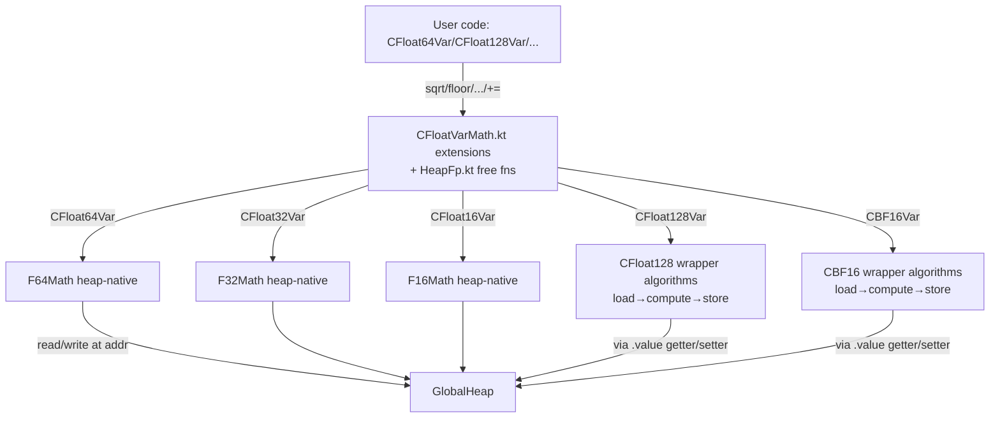

# Requirements

### Overview & Goals

Continue the heap-discipline pass (Slice 3). After Slice 1 (removed convenience operators) and Slice 2 (renamed `CDouble`→`CFloat64` and added `+= -= *= /=` and `+ - * /` to all 7 heap-FP scalars), the remaining gap is **math operations**: heap-FP users still have no first-class way to compute `sqrt`, `floor`, `ceil`, `trunc`, `round`, `frexp`, `ldexp`, `modf`, `abs`, or `copysign` on heap-resident values. They have to detour through wrapper types like `CFloat64`/`CFloat128`, which uses the native-FP bridge (`toDouble`/`fromDouble`) — exactly the shortcut the discipline pass is retiring.

This slice closes that gap by adding the same math vocabulary that wrapper types already expose, but operating directly on `CFloat*Var` heap addresses.

### Scope

**In scope**

- Add a math operator surface to all 7 heap-FP scalars (`CFloatVar`, `CFloat32Var`, `CFloat64Var`, `CFloat128Var`, `CLongDoubleVar`, `CFloat16Var`, `CBF16Var`).
- Operations: `sqrt`, `floor`, `ceil`, `trunc`, `round`, `abs`, `copysign`, `frexp`, `ldexp`, `modf`.
- Two ergonomic forms per op (matching Slice 2's pattern):
  - **In-place** (e.g., `v.sqrtAssign()`) — mutates the receiver's heap slot.
  - **Allocating** (e.g., `v.sqrt()`) — returns a fresh `CFloat*Var` on the current `KStack` frame.
- Free-function form for natural syntax: `sqrt(v)`, `floor(v)`, etc.
- Tests covering each op per type and confirming no native-scalar leakage at the API boundary.
- STATUS.md update marking Slice 3 done and `BasicMath.kt` follow-up resolved.

**Out of scope**

- Removing the wrapper-type math methods (`CFloat64.sqrt()` etc.) — Slice 4 territory.
- Native-FP bridge retirement (`toDouble`/`fromDouble`/`fromInt`/`fromLong`) — still blocked on a heap-resident literal mechanism.
- Transcendentals (`sin`, `cos`, `exp`, `log`) — separate phase.
- P0 bitwise violations cleanup — paused per user direction.
- `Float32Math.kt` raw-`Float` public API — left as a kernel layer; it's reachable only via the heap-typed wrappers added here.

### User Stories

- As a port author, I want to write `val r = sqrt(x); r += y` where `x`, `y`, `r` are all `CFloat64Var`, without ever touching `Double`.
- As a port author, I want `v.floorAssign()` to round `v` in place on the heap, with no allocation.
- As a port author, I want `(a + b).sqrt()` to chain naturally on heap-FP types.

### Functional Requirements

- Each math op must be available in both in-place (`*Assign`) and allocating forms on each of the 7 heap-FP types.
- Allocating forms must use `CAutos.<type>()` to land on the current `KStack` frame (same pattern as Slice 2's binary operators).
- Numeric semantics must match the existing wrapper-type instance methods (`CFloat64.sqrt()`, `CFloat128.sqrt()`, etc.) — bit-exact where the wrapper guarantees it.
- `frexp` returns a `Pair<CFloat*Var, Int>`; `modf` returns a `Pair<CFloat*Var, CFloat*Var>` (both newly allocated).
- `ldexp(exp: Int)` keeps `Int` for now (deliberate decision, deferred from Slice 1's open list); document the rationale.

### Non-Functional Requirements

- No new heap allocations beyond the documented stack-frame allocation in allocating forms.
- All 402 existing tests must remain green; new tests added per type.
- macosArm64 target only this session (consistent with prior slices).

# Technical Design

### Current Implementation

- `mem/CScalars.kt` defines `CFloatVar`, `CFloat32Var`, `CFloat64Var`, `CFloat128Var`, `CLongDoubleVar`, `CFloat16Var`, `CBF16Var` — each with a heap `addr` and a `value` getter/setter that round-trips through the wrapper type.
- `mem/CFloatVarOps.kt` (Slice 2) adds `+=`, `-=`, `*=`, `/=`, `+`, `-`, `*`, `/`, `unaryMinus` for each. Pattern: load both operands, do the math via the wrapper type, store back. Allocating forms call `CAutos.<type>()` to claim a fresh stack cell.
- Wrapper-type math methods exist on each FP type (e.g., `CFloat64.sqrt()`, `CFloat128.floor()`, `CBF16.frexp()`). They return wrapper instances and use `toDouble`/`fromDouble`/`Float32Math` internally.
- Heap-native math objects exist for sqrt/floor/etc.: `math/F64Math`, `math/F32Math`, `math/F16Math` — they take heap addresses and write results in place. These will be the preferred backend for the new operators where coverage exists.
- `CFloat128` and `CLongDouble` have **no** heap-native math object today — those types must use their existing wrapper algorithms internally (load both halves → compute → store both halves).

### Key Decisions

1. **Mirror Slice 2's pattern exactly.** Operators live in `mem/CFloatVarOps.kt` (or a new sibling file `mem/CFloatVarMath.kt` for organizational cleanliness — see File Structure). In-place forms mutate the receiver; allocating forms return a fresh `CAutos.<type>()` cell. Rationale: consistency with the just-shipped Slice 2 surface; users get a single mental model.

2. **Backend selection per type.**
   - `CFloat64Var` → `F64Math.sqrt/floor/ceil/...` (already heap-native).
   - `CFloat32Var` → `F32Math.sqrt/...` (already heap-native).
   - `CFloat16Var` → `F16Math.*` (already heap-native).
   - `CBF16Var` → no heap-native object today; route through `CBF16` wrapper algorithms (load → wrap → compute → unwrap → store). Native locals inside the function body are fine per the resolved discipline.
   - `CFloat128Var` → no heap-native object; load `hi`/`lo`, run `CFloat128.sqrt()` algorithm directly, store `hi`/`lo` back. (Open option: extract a `Float128Math` heap-native object as a follow-up; not required for Slice 3.)
   - `CLongDoubleVar` → flavor-aware: dispatch to F64/F128/EXTENDED80 path based on the var's flavor field.
   - `CFloatVar` → typealias-style: dispatch to whichever underlying type `CFloat` resolves to (currently `CFloat32` per existing code).

3. **`ldexp(exp: Int)` keeps `Int`.** Slice 1 flagged this as an open question. Decision: `Int` is a small integer count, not a math value; it does not represent a heap-storable scalar. Document this in the operator's KDoc.

4. **`frexp` returns `Pair<CFloat*Var, Int>`, `modf` returns `Pair<CFloat*Var, CFloat*Var>`.** Both auxiliary results allocated on the current stack frame. Same `Int`-for-counts rule as ldexp.

5. **Free-function form is package-level, in `math/HeapFp.kt`.** `fun sqrt(v: CFloat64Var): CFloat64Var = v.sqrt()` etc. — keeps the call site tidy (`sqrt(v)` reads more naturally than `v.sqrt()` in math expressions). One overload per type per op.

### Proposed Changes

#### File: `mem/CFloatVarMath.kt` (new)

Follows `CFloatVarOps.kt` shape. Per type, in this order:

```kotlin
// CFloat64Var
fun CFloat64Var.sqrtAssign() { F64Math.sqrt(addr, addr) }
fun CFloat64Var.sqrt(): CFloat64Var {
    val r = CAutos.cfloat64()
    F64Math.sqrt(r.addr, addr)
    return r
}
fun CFloat64Var.floorAssign() { F64Math.floor(addr, addr) }
fun CFloat64Var.floor(): CFloat64Var { val r = CAutos.cfloat64(); F64Math.floor(r.addr, addr); return r }
// ...ceil, trunc, round, abs, copysign(other), frexp, ldexp, modf
```

For `CFloat128Var` (no heap backend today):

```kotlin
fun CFloat128Var.sqrtAssign() {
    val v = this.value          // wraps to CFloat128 (heap-loaded)
    val r = v.sqrt()            // double-double Newton-Raphson
    this.value = r              // stores back to heap
}
// allocating form: CAutos.cfloat128() then call sqrtAssign on result after copy
```

This is the load → compute → store pattern; it matches the resolved discipline (heap at the API boundary; native locals inside the body are fine).

#### File: `math/HeapFp.kt` (new)

```kotlin
fun sqrt(v: CFloat64Var): CFloat64Var = v.sqrt()
fun sqrt(v: CFloat128Var): CFloat128Var = v.sqrt()
// ...same for all 7 types and all ops
```

Keeps math-expression syntax tidy. Pure forwarding; no new logic.

#### File: `summaries/STATUS.md`

Add "2026-04-25 Update — Heap Discipline Pass (Slice 3)" section. Mark `BasicMath.kt Double-kernel wrapping` follow-up as **DONE**. Update remaining follow-ups list (native-FP bridge, `Float32Math.kt` raw-Float kernel are still open).

### Data Models / Contracts

No new types. Per-type signatures (illustrative for `CFloat64Var`; replicated for each):

```kotlin
fun CFloat64Var.sqrtAssign()
fun CFloat64Var.sqrt(): CFloat64Var
fun CFloat64Var.floorAssign()
fun CFloat64Var.floor(): CFloat64Var
fun CFloat64Var.ceilAssign()
fun CFloat64Var.ceil(): CFloat64Var
fun CFloat64Var.truncAssign()
fun CFloat64Var.trunc(): CFloat64Var
fun CFloat64Var.roundAssign()
fun CFloat64Var.round(): CFloat64Var
fun CFloat64Var.absAssign()
fun CFloat64Var.abs(): CFloat64Var
fun CFloat64Var.copysignAssign(sign: CFloat64Var)
fun CFloat64Var.copysign(sign: CFloat64Var): CFloat64Var
fun CFloat64Var.frexp(): Pair<CFloat64Var, Int>
fun CFloat64Var.ldexpAssign(exp: Int)
fun CFloat64Var.ldexp(exp: Int): CFloat64Var
fun CFloat64Var.modf(): Pair<CFloat64Var, CFloat64Var>
```

### Components

- **New** `mem/CFloatVarMath.kt` — extension operators. ~700 lines.
- **New** `math/HeapFp.kt` — package-level free functions. ~150 lines.
- **New** `mem/CFloatVarMathTest.kt` — tests, ~200 lines.
- **Modified** `summaries/STATUS.md` — Slice 3 entry.
- **Untouched** `CFloat64.kt`, `CFloat128.kt`, etc. — wrapper-type math methods stay (used internally by CFloat128Var/CLongDoubleVar paths and as Slice 4 targets).
- **Untouched** `F64Math.kt`, `F32Math.kt`, `F16Math.kt` — already heap-native; consumed as backends.

### File Structure

```
src/commonMain/kotlin/ai/solace/klang/
├── mem/
│   ├── CFloatVarOps.kt        (Slice 2 — arithmetic)
│   └── CFloatVarMath.kt       (NEW — Slice 3)
├── math/
│   ├── F64Math.kt             (existing, used as backend)
│   ├── F32Math.kt             (existing, used as backend)
│   ├── F16Math.kt             (existing, used as backend)
│   └── HeapFp.kt              (NEW — free-function math)
src/commonTest/kotlin/ai/solace/klang/
└── mem/
    ├── CFloatVarOpsTest.kt    (Slice 2)
    └── CFloatVarMathTest.kt   (NEW)
```

### Architecture Diagram



### Risks

- **`CFloat128Var.sqrt` allocation overhead.** The wrapper-routed path constructs a `CFloat128` data class instance per call. Mitigation: acceptable for Slice 3; a future optimization can extract a heap-native `Float128Math` object for in-place sqrt.
- **`CLongDoubleVar` flavor confusion.** Slice 2 fixed a latent NPE in `CLongDoubleVar.value` by hard-coding `Flavor.EXTENDED80`. Math ops must use the same convention to avoid regression. Test will exercise this explicitly.
- **Test isolation.** Stack-allocating forms require an active `KStack` frame; tests must wrap calls in `withStackFrame { }` or equivalent. Match the pattern from `CFloatVarOpsTest.kt`.
- **Free-function shadowing.** Adding `fun sqrt(v: CFloat64Var)` in package `math` could shadow Kotlin's `kotlin.math.sqrt` in files that import both. Mitigation: place free functions in a distinct package or require explicit import; document in KDoc.

# Testing

### Validation Approach

For each of the 7 heap-FP types and each of the 10 math ops, add at least one round-trip test that:

1. Sets a known value on a heap-FP var.
2. Calls the in-place form (`*Assign`).
3. Reads back and asserts bit-exact match against the wrapper-type result on the same input.
4. Repeats with the allocating form, checking that the receiver is unchanged and the returned var holds the expected value.

For `CFloat128`, add a precision-sensitive case (e.g., `sqrt(2)² ≈ 2` to <1e-28) to confirm the double-double algorithm is genuinely exercised, not silently downgraded to `Double`.

### Key Scenarios

- `CFloat64Var.sqrtAssign()` on `2.0` → `1.4142135623730951` (exact `Double.fromBits` match).
- `CFloat128Var.sqrt()` on `2.0` → result² within 1e-28 of `2.0`.
- `CFloat64Var.floor()` on `-1.5` → `-2.0`; `ceil()` → `-1.0`; `round()` → `-2.0` (round-half-away).
- `CFloat64Var.frexp()` on `12.0` → mantissa `0.75`, exponent `4`.
- `CFloat64Var.ldexp(3)` on `1.5` → `12.0`.
- `CFloat64Var.modf()` on `3.75` → integer `3.0`, fractional `0.75`.
- `CFloat64Var.copysign(neg)` where neg < 0 → result has negative sign.
- Free-function form: `sqrt(v)` produces same value as `v.sqrt()`.
- **CLongDoubleVar regression check**: math ops do not trigger the latent NPE Slice 2 fixed.

### Edge Cases

- `sqrt(NaN)` → NaN propagation (each type).
- `sqrt(-0.0)` → `-0.0` (preserves negative zero).
- `sqrt(+Inf)` → `+Inf`.
- `floor(+Inf)`/`ceil(-Inf)` → unchanged.
- `frexp(0.0)` → `(0.0, 0)`.
- `ldexp(x, 0)` → `x`.
- `modf(3.0)` → `(3.0, 0.0)` exactly.
- Stack-frame discipline: assert allocating forms claim memory on the current `KStack` and not the global heap.

### Test Changes

- **New** `CFloatVarMathTest.kt` — ~25–30 tests across all 7 types and all 10 ops.
- **No change** to existing 402 tests; they remain green.

# Delivery Steps

### ✓ Step 1: Stage 1 — CFloat64Var math surface
`CFloat64Var` carries a complete in-place + allocating math vocabulary backed by `F64Math` heap-native ops.

- Create `mem/CFloatVarMath.kt`. Add the `CFloat64Var` block first (smallest blast radius, most-used type, sets the pattern for the others).
- Implement, for `CFloat64Var`: `sqrtAssign`/`sqrt`, `floorAssign`/`floor`, `ceilAssign`/`ceil`, `truncAssign`/`trunc`, `roundAssign`/`round`, `absAssign`/`abs`, `copysignAssign`/`copysign`, `frexp`, `ldexpAssign`/`ldexp`, `modf`.
- Each in-place form delegates to `F64Math.<op>(addr, addr)`. Each allocating form claims `CAutos.cfloat64()` and calls `F64Math.<op>(r.addr, addr)`.
- `frexp` returns `Pair<CFloat64Var, Int>`; `modf` returns `Pair<CFloat64Var, CFloat64Var>` — both freshly allocated.
- Add the first batch of tests in `mem/CFloatVarMathTest.kt` covering every CFloat64Var op (10 ops × ≥1 round-trip case each, plus key edge cases: NaN, ±0, ±Inf for sqrt/floor/ceil).

### ✓ Step 2: Stage 2 — CFloat128Var math surface (precision-sensitive)
`CFloat128Var` carries the same math vocabulary, preserving ~106-bit double-double precision.

- Add `CFloat128Var` operators in `mem/CFloatVarMath.kt`. Each method loads `hi`/`lo` via the existing `value` getter, runs the algorithm on the wrapper instance (`CFloat128.sqrt()` etc.), and writes both halves back via `value = ...`.
- Cover all 10 ops: sqrt, floor, ceil, trunc, round, abs, copysign, frexp, ldexp, modf.
- Add tests asserting double-double precision is preserved: `sqrt(2.0)²` round-trip error < 1e-28, `(1/3)*3 == 1` already exercised by Slice 2 — extend with a sqrt-based identity (e.g., `(sqrt(x))² ≈ x` for several x).
- Validate `frexp` returns the correct exponent derived from `hi` and `ldexp` scales both halves consistently.

### ✓ Step 3: Stage 3 — CFloat32Var, CFloat16Var, CBF16Var, CLongDoubleVar, CFloatVar math surfaces
All remaining heap-FP scalars carry the math vocabulary; latent CLongDoubleVar flavor bug stays squashed.

- Add operator blocks in `mem/CFloatVarMath.kt` for `CFloat32Var` (backend: `F32Math.*`), `CFloat16Var` (backend: `F16Math.*`), `CBF16Var` (backend: load → `CBF16` wrapper algorithm → store), `CLongDoubleVar` (flavor-aware dispatch — match the `Flavor.EXTENDED80` convention Slice 2 established to avoid the NPE), `CFloatVar` (forwards to underlying CFloat32Var).
- Each type gets the same 10 ops in both forms.
- Add per-type smoke tests in `CFloatVarMathTest.kt` — at minimum sqrt + floor + frexp + modf per type — confirming the wrapper-routed paths preserve numeric semantics.
- Explicit regression test: `CLongDoubleVar.sqrt()` does not throw NPE (covers the Slice 2 latent-bug area).

### ✓ Step 4: Stage 4 — Free-function math layer + STATUS.md
Heap-FP math is callable in natural `sqrt(v)` syntax; project status reflects the new milestone.

- Create `math/HeapFp.kt` with package-level free functions: `sqrt`, `floor`, `ceil`, `trunc`, `round`, `abs`, `copysign`, `frexp`, `ldexp`, `modf` — overloaded once per heap-FP type (7 types × 10 ops). Each function is one line, forwarding to the corresponding extension method.
- Add 1–2 free-function tests per type to confirm parity with the extension form.
- Update `summaries/STATUS.md`: add a "Heap Discipline Pass (Slice 3)" section describing what landed, mark the `BasicMath.kt Double-kernel wrapping` follow-up as DONE, restate the remaining follow-ups (native-FP bridge retirement, `Float32Math.kt` raw-Float kernel decision).
- Run `./gradlew :compileKotlinMacosArm64` and `./gradlew :macosArm64Test`; expect all prior 402 tests + the new ~30 to pass on macosArm64. Document the new total in STATUS.md.